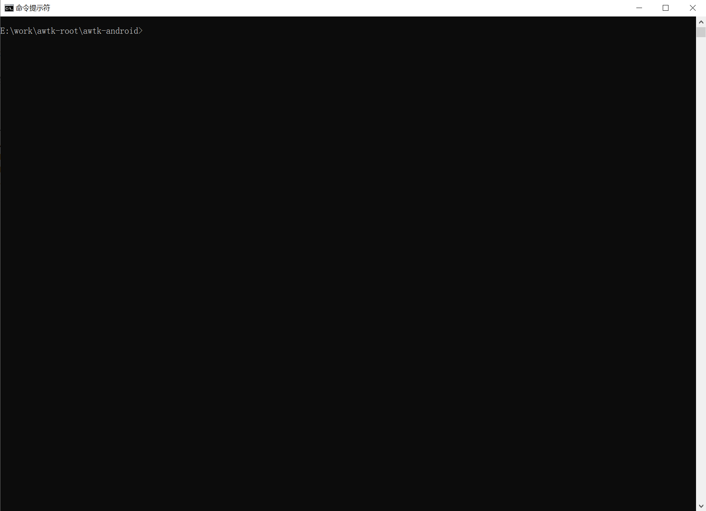

# 在 windows 上编译

## 1. 使用 cmd.exe

运行 cmd.exe 进入命令行界面。


进入 awtk-android 目录。



### 1.1 设置环境变量

设置下列环境变量，其取值根据自己的情况修改。

> 路径分隔符用 "\\"

示例：

```bat
set JAVA_HOME="d:\\Program Files\\Android\\Android Studio\\jre"
set ANDROID_HOME=C:\\Users\\Admin\\AppData\\Local\\Android\\Sdk
set ANDROID_NDK_HOME=C:\\Users\\Admin\\AppData\\Local\\Android\\Sdk\\ndk\\21.3.6528147
set Path=%Path%:%ANDROID_NDK_HOME%
```

> 参考 scripts/env.bat，你可以直接修改这个文件。


### 1.2 创建 demou 的工程


### 1.3 编译

```
cd build/demoui && gradlew build
```

### 1.4 安装

插上测试手机（打开开发者模式，允许 adb 安装 apk)

```
adb install -r app/build/outputs/apk/debug/app-debug.apk
```


