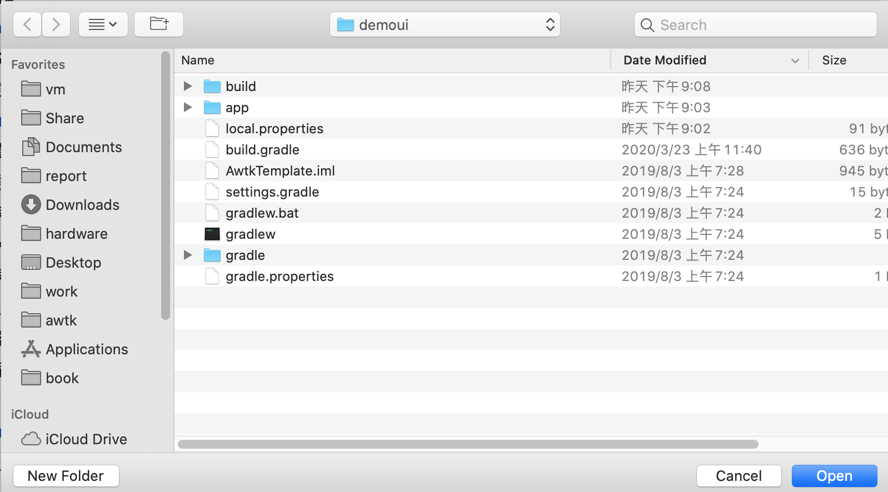
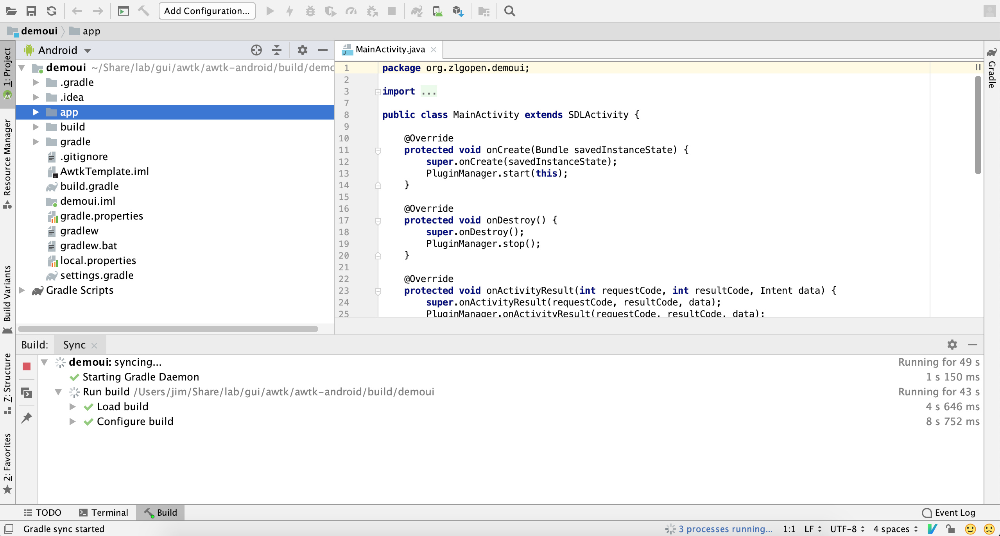

# 如何用android studio调试awtk android app

用create_project.py生成android app的工程之后，可以直接在命令行下编译和安装apk。如果app遇到运行时问题，则需要借助android studio了。

## 用android studio导入awtk app

* 运行android studio，在启动界面选择"Import project(Gradle,Eclipse ADT,etc)

* 选择前面生成的awtk app的目录(如demoui)。

* 导入之后android studio自动开始编译，通常需要比较久的时间，请耐心等待。

## 调试

	
